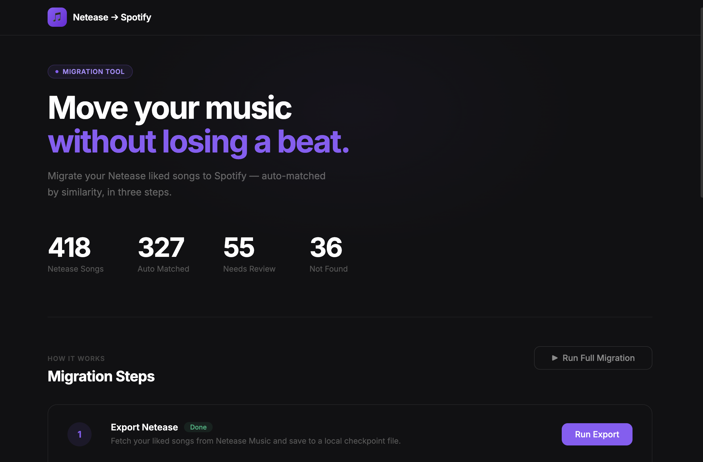
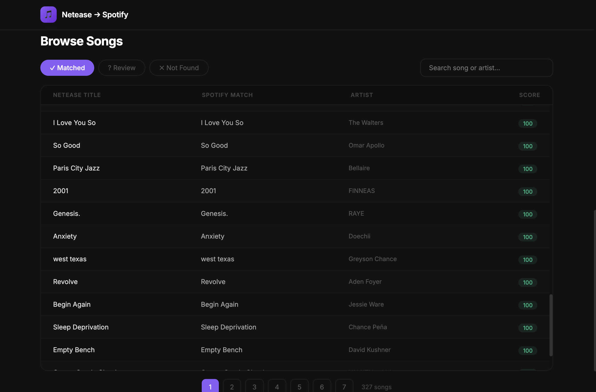
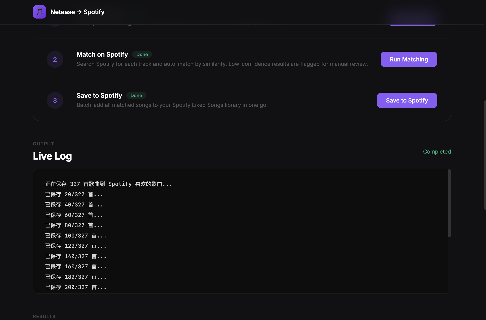
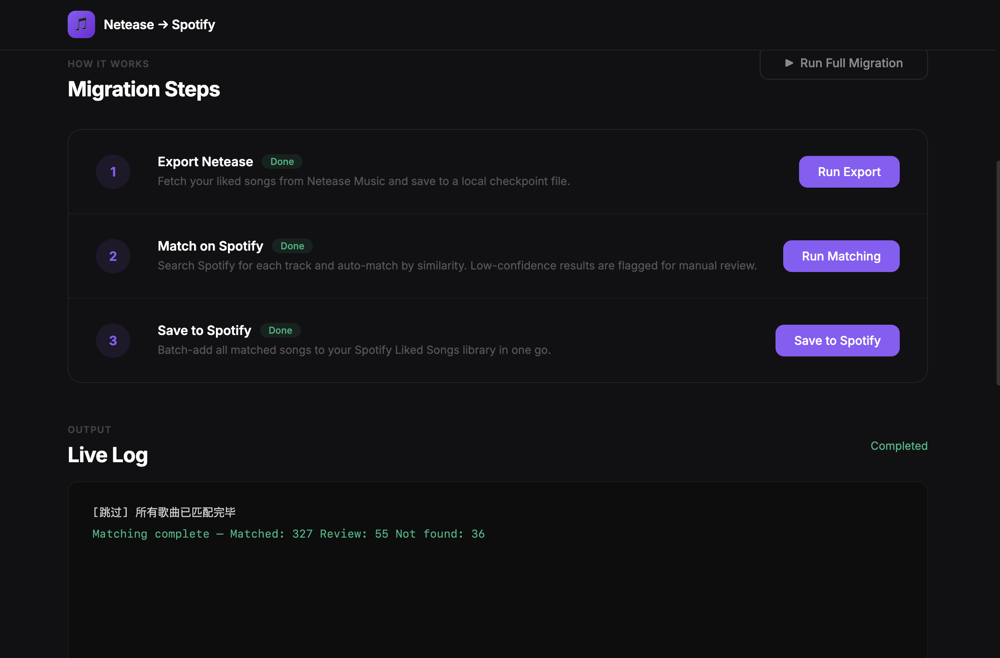

# Netease → Spotify Migration Tool

A web-based tool that automatically migrates your liked songs from **Netease Music (网易云音乐)** to **Spotify** — built with Python and Flask, with a clean dark-themed UI.

---

## The Problem

I had years of liked songs on Netease Music and wanted to switch to Spotify. There was no official way to transfer them. I built this tool to solve that.

---

## How It Works

The migration runs in three steps, each triggered by a button in the UI:

**Step 1 — Export from Netease**
Fetches your liked songs from Netease Music via its API using your account cookies, and saves them locally as a checkpoint file.

**Step 2 — Match on Spotify**
Searches Spotify for each song by title and artist name, then scores each match by similarity. Songs above the confidence threshold are auto-accepted; low-confidence results are flagged for manual review.

**Step 3 — Save to Spotify**
Batch-adds all matched songs to your Spotify Liked Songs library in groups of 20, with automatic rate-limit handling.

---

## Screenshots

### Dashboard
Displays live stats and the three-step migration panel.



> In this run: **418** Netease songs → **327** auto-matched, **55** flagged for review, **36** not found.

---

### Browse Songs
After matching, you can browse all results across three tabs: Matched, Review, and Not Found. Each row shows the original Netease title, the Spotify match found, the artist, and the similarity score.



---

### Live Log — Running
While a migration step is running, the UI streams real-time log output so you can watch the progress.



---

### Completed
Once all three steps finish, the log shows a final summary and all step badges turn green.



---

## Tech Stack

| Layer | Technology |
|---|---|
| Backend | Python 3, Flask |
| Netease API | Direct HTTP requests with cookie auth |
| Spotify API | [Spotipy](https://spotipy.readthedocs.io/) (OAuth 2.0) |
| Frontend | Vanilla HTML/CSS/JS (no framework) |
| Streaming | Server-Sent Events (SSE) for real-time log output |
| Config | python-dotenv |

---

## Project Structure

```
netease-to-spotify/
├── app.py            # Flask server — routes and SSE streaming
├── migrate.py        # Orchestrates the three migration phases
├── netease.py        # Netease Music API client
├── matcher.py        # Spotify search and similarity scoring
├── spotify_client.py # Spotify OAuth and batch save logic
├── static/
│   └── index.html    # Single-page UI
└── docs/             # Screenshots
```

---

## Setup & Usage

### 1. Install dependencies

```bash
pip install -r requirements.txt
```

### 2. Configure environment variables

Create a `.env` file in the project root:

```
# Netease Music — get these from your browser cookies after logging in
NETEASE_MUSIC_U=your_cookie_value
NETEASE_CSRF=your_csrf_token
NETEASE_UID=your_user_id

# Spotify — create an app at developer.spotify.com
SPOTIPY_CLIENT_ID=your_client_id
SPOTIPY_CLIENT_SECRET=your_client_secret
SPOTIPY_REDIRECT_URI=http://127.0.0.1:8888/callback
```

### 3. Run

```bash
python app.py
```

Then open [http://localhost:5050](http://localhost:5050) in your browser.

---

## Key Design Decisions

- **Checkpoint files** — each phase saves its output to a JSON file before the next phase starts, so if anything fails mid-way, you can resume without re-doing completed work.
- **Similarity scoring** — instead of only accepting exact title matches, the matcher scores results by string similarity, which handles minor differences in song name formatting between the two platforms.
- **SSE streaming** — the backend captures stdout from the running migration and pushes each log line to the frontend in real time via Server-Sent Events, giving the UI a live terminal feel without polling.
- **Rate limit handling** — the Spotify batch save respects `Retry-After` headers automatically when the API returns a 429 response.
